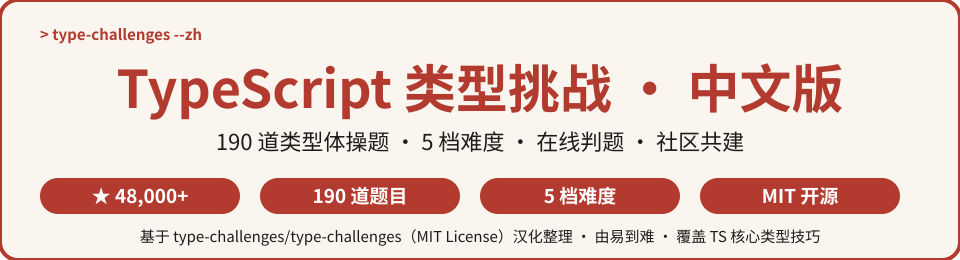
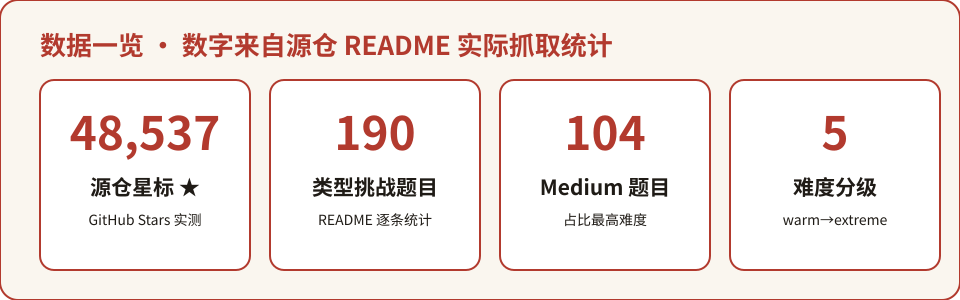

<p align="center">
  
</p>

# TypeScript 类型挑战 · 中文版

> **全球最流行的 TypeScript 类型体操题库 · 中文导读版**
>
> 源自 GitHub 上 **48,000+ ★** 的 [type-challenges/type-challenges](https://github.com/type-challenges/type-challenges)，收录 **190 道类型挑战题**，覆盖 warm-up / easy / medium / hard / extreme **5 档难度**，在线判题 + 社区讨论，是掌握 TypeScript 高级类型系统的必修题库。


---

⭐ 如果对你有帮助，点个 Star 支持中文开源

## 目录

- [这是什么？](#这是什么)
- [为什么值得收藏](#为什么值得收藏)
- [数据一览](#数据一览)
- [快速开始](#快速开始)
- [分类清单](#分类清单)
- [全量题目索引](#全量题目索引)
- [完整数据](#完整数据)
- [常见问题 FAQ](#常见问题-faq)
- [参与贡献](#参与贡献)
- [致谢](#致谢)
- [许可声明](#许可声明)

---

## 这是什么？

**TypeScript 类型挑战 · 中文版** 是对全球最流行的 TypeScript 类型体操题库 [type-challenges/type-challenges](https://github.com/type-challenges/type-challenges) 的中文二次开发项目。

源项目收集了 **190 道类型挑战题**：利用 TypeScript 著名的类型系统（README 原文戏称其 Turing Complete，并链接了 [microsoft/TypeScript#14833](https://github.com/microsoft/TypeScript/issues/14833)），把 `type` 当成一门编程语言来玩——实现 `Pick`、`Readonly`、`Omit` 这样的内置工具类型，甚至写出简易 Vue、柯里化、JSON Parser 等硬核类型。所有挑战均在 **strict 模式**下工作，不运行任何代码，纯类型层面解题。

**中文版做了什么：**

- 🗂️ 把源仓 **190 道题** 全量提取为中文索引（[questions-index.md](questions-index.md)），按 5 档难度分组，点开即做题；
- ⚡ 在本 README 精选 **24 道热门题**，配中文译名 + 一句话考点；
- 📖 提炼上手路径与 FAQ，让你从零开始进入类型体操的世界。

## 为什么值得收藏

- 🧠 **高级类型系统速成**：Pick / Omit / Deep Readonly / 柯里化 / 模板字面量类型……刷完等于把 TS 类型能力拉满；
- 🎯 **纯类型 · 零运行时**：每道题只写 `type`，不跑代码、不装依赖，浏览器里就能玩；
- 🏆 **在线判题**：社区维护的判题服务 + GitHub Discussions 讨论区，提交即得反馈；
- 📚 **由易到难**：warm-up 热身 → easy 13 题 → medium 104 题 → hard 55 题 → extreme 17 题，梯度清晰；
- 🇨🇳 **中文友好**：全量索引 + 精选译名 + 上手指引，英文题面也不再劝退。

## 数据一览

<p align="center">
  
</p>

> 数字全部来自源仓 [README.md](https://github.com/type-challenges/type-challenges/blob/main/README.md) 挑战列表实际抓取统计（2026-10-05 核实）。

## 快速开始

### 三步上手

<p align="center">
  
</p>

1. **浏览选题**：在下方精选清单或 [全量索引](questions-index.md) 中按难度选题——新手建议从 warm-up 的 Hello World 开始；
2. **动手写类型**：把题面要求实现成 `type` 工具类型，全程只写类型、不写逻辑，在 strict 模式下练习；
3. **提交过判题**：把解答提交到社区判题服务（或直接在 TypeScript Playground 安装 `@type-challenges/playground-plugin` 插件验证），与全球玩家在 GitHub Discussions / Discord 交流。

### 示例：从 easy 的 Pick 开始

源仓第 4 题 Pick 要求实现内置工具类型 `Pick<T, K>`——从 `T` 中挑选出 `K` 指定的属性：

```typescript
type MyPick<T, K extends keyof T> = {
  [P in K]: T[P];
};

// 使用：只保留 'title' 与 'completed' 两个字段
interface Todo { title: string; description: string; completed: boolean; }
type TodoPreview = MyPick<Todo, 'title' | 'completed'>;
```

接着试试 Readonly（第 7 题，把对象所有属性变为只读）、First of Array（第 14 题，取数组首元素）——都是面试高频类型题。

### 示例：进阶的 Deep Readonly

第 9 题 Deep Readonly 要求**递归**地把嵌套对象的每一层属性都变为只读：

```typescript
type DeepReadonly<T> = T extends (...args: any[]) => any
  ? T
  : { readonly [K in keyof T]: DeepReadonly<T[K]> };
```

> 更多题目与题解入口，见 [questions-index.md](questions-index.md)。

## 分类清单

精选 **24 道热门类型挑战**（完整 190 道见 [questions-index.md](questions-index.md)）：

| 难度 | 题号 | 英文题名 | 中文译名 | 一句话考点 |
| --- | --- | --- | --- | --- |
| Warm-up | 00013 | Hello World | 你好，世界 | 输出字符串类型，热身入门 |
| Easy | 00004 | Pick | 挑选属性 | 实现内置工具类型 Pick |
| Easy | 00007 | Readonly | 全部只读 | 对象属性一键只读 |
| Easy | 00014 | First of Array | 数组首元素 | 取数组首个元素类型 |
| Easy | 00018 | Length of Tuple | 元组长度 | 用元组特性数长度 |
| Easy | 00011 | Tuple to Object | 元组转对象 | 键值对数组转对象类型 |
| Medium | 00002 | Get Return Type | 获取返回类型 | infer 提取函数返回值 |
| Medium | 00003 | Omit | 省略属性 | 剔除指定键构造新类型 |
| Medium | 00009 | Deep Readonly | 深度只读 | 递归只读嵌套对象 |
| Medium | 00012 | Chainable Options | 链式选项 | 泛型链式 API 的类型推导 |
| Medium | 00015 | Last of Array | 数组末元素 | 取数组末尾元素类型 |
| Medium | 00016 | Pop | 弹出末元素 | 去掉数组最后一个元素 |
| Medium | 00020 | Promise.all | 全量等待 | Promise 数组的类型推导 |
| Medium | 00108 | Trim | 去除首尾空格 | 模板字面量类型去空白 |
| Medium | 00110 | Capitalize | 首字母大写 | 模板字面量改首字母 |
| Medium | 00010 | Tuple to Union | 元组转联合 | 元组元素展开为联合类型 |
| Hard | 00006 | Simple Vue | 简易 Vue | 重写迷你 Vue 类型推导 |
| Hard | 00017 | Currying 1 | 柯里化（一） | 函数柯里化的类型实现 |
| Hard | 00055 | Union to Intersection | 联合转交集 | 逆变位置合并联合类型 |
| Hard | 00057 | Get Required | 提取必填键 | 挑出必填属性键 |
| Hard | 02822 | Split | 字符串分割 | 按分隔符拆分字符串字面量 |
| Extreme | 00005 | Get Readonly Keys | 提取只读键 | 找出全部只读属性键 |
| Extreme | 00151 | Query String Parser | 查询字符串解析器 | 把 query 解析成对象类型 |
| Extreme | 00216 | Slice | 数组切片 | 实现类型版数组 slice |

## 全量题目索引

📄 **[questions-index.md](questions-index.md)** — 收录源仓全部 **190 道题**：题号 + 英文题名 + 源题目直达链接，按 warm-up / easy / medium / hard / extreme 五档分组，即点即做。

## 完整数据

- 📦 源仓库：[type-challenges/type-challenges](https://github.com/type-challenges/type-challenges)（默认分支 main，MIT License）
- 🧪 TypeScript Playground 插件：`@type-challenges/playground-plugin`（安装链接见源仓 README）
- 💬 官方 Discord：[type-challenges Discord](https://discord.gg/UgKBCq9)
- 📄 源 README（英文原文）：[README.md](https://github.com/type-challenges/type-challenges/blob/main/README.md)

## 常见问题 FAQ

**Q1：我 TypeScript 基础一般，能刷吗？**

可以。建议从 warm-up 和 easy 开始（Hello World、Pick、Readonly 都是入门友好题），配合 [TypeScript 官方手册](https://www.typescriptlang.org/docs/handbook/) 边学边练；medium 开始建议先掌握 `keyof`、`infer`、模板字面量类型与递归类型。

**Q2：题目只写类型不写逻辑？**

对。这是「类型体操」：全部在类型层面实现工具类型，不涉及运行时逻辑。源项目要求所有挑战在 strict 模式下工作。

**Q3：做完怎么验证？**

两种方式：① 在 TypeScript Playground 安装官方插件 `@type-challenges/playground-plugin` 直接判题；② 提交到社区维护的判题服务，并在 GitHub Discussions / Discord 讨论题解。

**Q4：有没有现成题解参考？**

源项目社区有大量公开题解（如 [type-challenges-solutions](https://github.com/ghaiklor/type-challenges-solutions)、[type-gymnastics](https://github.com/g-plane/type-gymnastics) 等，见源仓 README），卡住时先自己琢磨，再对照学习。

**Q5：这个中文版和源项目是什么关系？**

本项目是中文**索引与导读**，题目、判题、讨论都在源项目。所有题目链接均跳转源仓，版权归源项目及社区贡献者。

## 参与贡献

- 🐛 发现译名或链接错误：提 Issue；
- 🌐 补充 / 修正中文译名：Fork 后修改 [questions-index.md](questions-index.md) 提 PR；
- 📝 分享你的题解与踩坑经验：欢迎在 Issue 或 Discussions 交流。

## 致谢

- 感谢 [type-challenges/type-challenges](https://github.com/type-challenges/type-challenges) 全体维护者与贡献者（[contributors](https://github.com/type-challenges/type-challenges/graphs/contributors)）共建这套了不起的类型题库；
- 感谢 TypeScript 团队与社区（type-fest、ts-toolbelt、utility-types 等库的启发，见源仓 README）；
- 感谢每一位正在类型体操路上通关的你 🌟

## 许可声明

- 本仓库代码与文档：**MIT License**（见 [LICENSE](LICENSE)，Copyright (c) 2026 zieang88888）；
- 源项目 [type-challenges/type-challenges](https://github.com/type-challenges/type-challenges)：**MIT License**；
- 第三方声明与完整署名见 [THIRD_PARTY_NOTICES.md](THIRD_PARTY_NOTICES.md)。

## 姊妹项目

中文开源矩阵，一网打尽开发者的知识库：

- [zhskills · 中文技能库](https://github.com/zieang88888/zhskills)
- [awesome-ai-tools-zh · AI 工具导航](https://github.com/zieang88888/awesome-ai-tools-zh)
- [free-programming-books-zh · 编程书籍大全](https://github.com/zieang88888/free-programming-books-zh)
- [system-design-zh · 系统设计面试](https://github.com/zieang88888/system-design-zh)
- [awesome-python-zh · Python 生态导航](https://github.com/zieang88888/awesome-python-zh)
- [ohmyzsh-zh · 终端效率神器](https://github.com/zieang88888/ohmyzsh-zh)
- [llm-course-zh · LLM 课程导航](https://github.com/zieang88888/llm-course-zh)
- [design-resources-for-developers-zh · 设计资源大全](https://github.com/zieang88888/design-resources-for-developers-zh)
